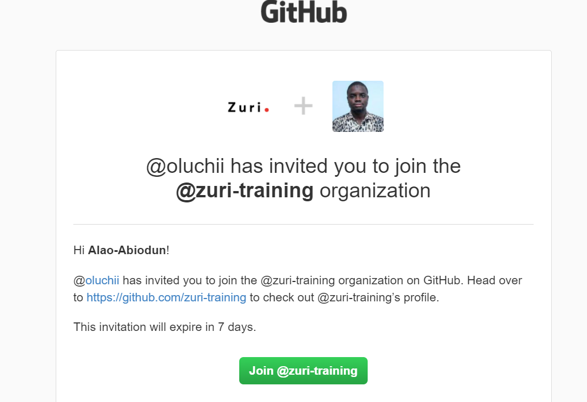
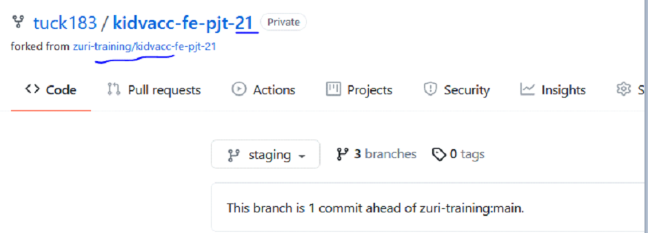
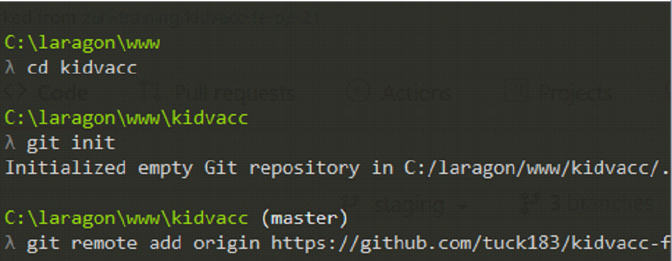
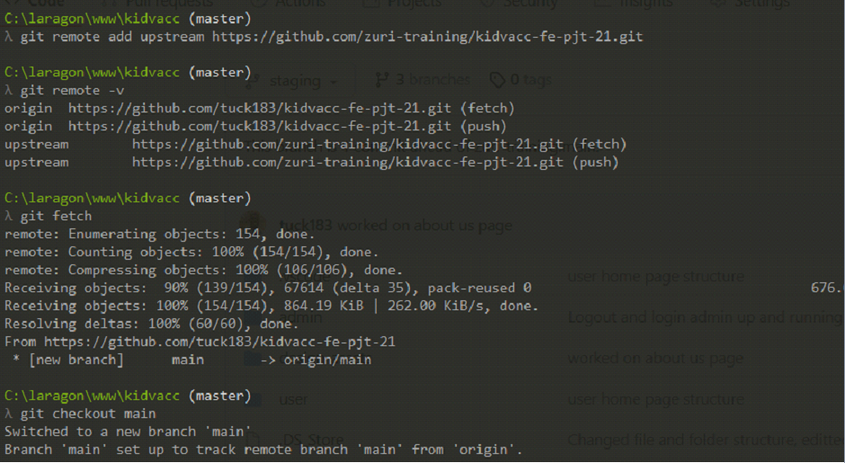

# How to use git and github

In this tutorial we will be learning how to use git and github to collaborate and even automate effectively in a team.

These process are very simple, but developer still find it hard to grasp the steps very well, and mostly is how to automate their own repository with the team repository.

## What is Git and Github?

- Git consist of commands used in communicating with the project, Git is an open-source and version control system that helps to interact with projects, and also helps to keep track of these projects from beginning to end without any issues arising.

Git is a free and open source distributed version control system designed to handle everything from small to very large projects with speed and efficiency.

- Github is a collaborative platform that helps to manage our project and it promotes interactions between developers helping them to know the stages of their project.

On the other hand, Github offers the distributed version control and source code management functionality of Git.

## Prerequisite

To follow along with this tutorial, you will need:

- Download and install the latest version of git 

- Create An Account on Github

## Accepting an invitation and getting started with the repository.

To get started, we'll need to follow some steps.

Firstly, There are many ways to contribute to team repositories, and some repository can be private or public, but if its private you will have to be send an invite to join the team repository.

## STEP 1: Getting Started to Collaborate on the team github repository.

Firstly, you will be send an invitation to join the team repository, and you will see a notification in your email account. Click on the "Join" button and you will direct to the team repository. which means you now have access to the team repository and you can fork and clone the team repository. Here is screen of a github invite to the team repository. 

## STEP 2: Some Automations Techniques involve contributing to the team repository using git and github.

- Accept the gitub invite.

- Click on the Fork button to fork the repository.

- Notice the url change from `https://github.com/zuri-training /kidvacc-fe-pjt-21` to `https://github.com/tuck183/kidvacc-fe-pjt-21`

Above, is the main team repository, while the second url is your own fork repository which is a copy of the team repository.

- Open cmd line

- copy your own url forked repository and clone it your local system using command `git clone https://github.com/tuck183/kidvacc-fe-pjt-21`

- Locate the name of the project which is `kidvacc-fe-pjt-21`

- Initialize git using `git init`

- Set origin and upstream

- Upstream refers to the zuri repo(main repository)

- Origin refers to the forked repo(Copy of main repository)

- Add origin: `git remote add origin https://github.com/tuck183/kidvacc-fe-pjt-21.git`

- To add upstream: `git remote add upstream https://github.com/zuri-training /kidvacc-fe-pjt-21.git`

- To check if added use `git remote –v`

- Fetch origin using `git fetch origin `

- Git checkout main or the branch you want to checkout

- After working on your own file

- Add the files to git using git add .

- Commit your files using git commit –m “descriptive-message”

- Push your files to your origin using `git push origin main`

- After pushing create pull request from your github page

# Links

[Download Git](https://git-scm.com/)

[Register A Github Account](https://github.com/)

